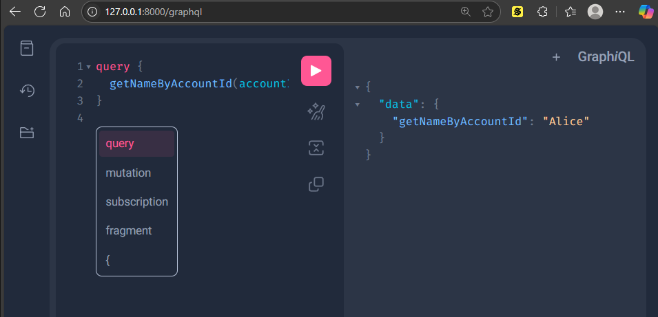

# 🚀 FastAPI GraphQL Server with Strawberry

Simple GraphQL API using **FastAPI** and **Strawberry GraphQL**.

---

## 🐍 Python Version

ใช้กับ **Python 3.8+**
(ทดสอบแล้วใช้งานได้กับ Python **3.13.1**)

---

## 🧰 Installation

ติดตั้งไลบรารีที่จำเป็น:

```bash
pip install "uvicorn[standard]" strawberry-graphql[fastapi]
```

## 🧰 Run server

```bash
python -m uvicorn app:app --reload
```

```bash
http://127.0.0.1:8000/graphql
```



Command

```bash
query {
  getNameByAccountId(accountId: 1)
}
```

## 📮ใช้ Postman ทดสอบ GraphQL python server📮

### 🔗 URL

```
POST http://127.0.0.1:8000/graphql
```

### 🔧 Headers

| Key          | Value            |
| ------------ | ---------------- |
| Content-Type | application/json |

### 🧾 Body → Raw → JSON

```json
{
  "query": "query { getNameByAccountId(accountId: 1) }"
}
```

### 📤 Result

```json
{
  "data": {
    "getNameByAccountId": "Alice"
  }
}
```
